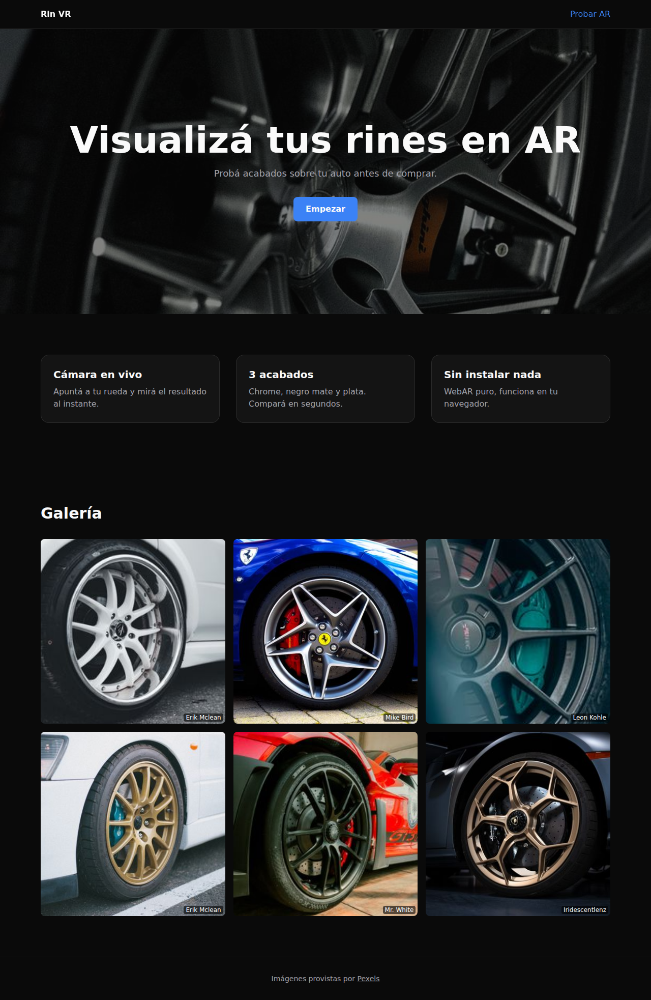
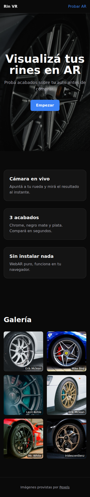
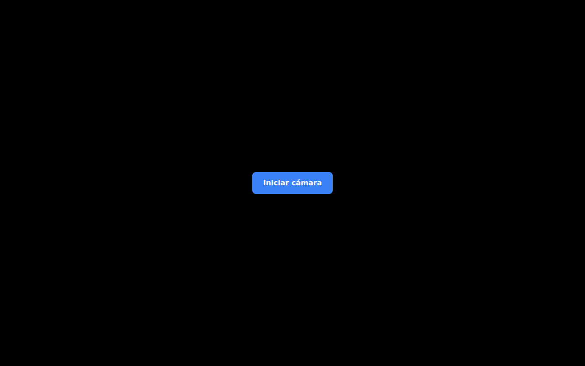

# Rin VR Vision

WebAR rim visualizer — point your phone camera at your wheel, pick a rim from a CC0 catalog, preview PBR finishes in real time. No app install.

**Live demo:** https://rin.andresmorales.com.co/app



## What it does

- Live camera feed with the rim composited on top via WebGL
- **Multi-rim catalog** — pick between CC0 wheel GLBs (curated from Sketchfab + Poly.pizza + Quaternius), swap with one tap
- Three PBR finishes (chrome, matte-black, silver) — switchable from a carousel
- **Auto-detect (experimental)** — MediaPipe Tasks Vision finds the wheel in the frame and prefills the calibration (lazy-loaded; ~9 MB on demand)
- Drag / pinch / two-finger rotate gestures to fine-tune the rim
- Hidden settings sheet for 6-slider fine calibration (slide up from ⚙)
- Gallery sourced from Pexels (CC0) for the landing page
- Spanish UI, mobile-first, works on Android Chrome and iPhone Safari



## Tech stack

| Layer | |
|---|---|
| Framework | Next.js 14 (App Router) + React 18 + TypeScript strict |
| 3D | `@react-three/fiber` + `@react-three/drei` + `three.js` |
| ML (optional) | `@mediapipe/tasks-vision` Object Detector (EfficientDet-Lite0) — lazy-loaded |
| Styling | Tailwind CSS (custom design tokens in `src/lib/design-tokens.ts`) |
| Testing | Vitest + Testing Library + jsdom |
| Photos | Pexels API (server-side fetch with 1 h ISR) |
| SEO/PWA | Next.js file conventions (opengraph-image, icon, robots, sitemap, manifest) + next/og dynamic OG |
| Deploy | Docker (multi-stage, `node:24-alpine`, standalone output, 186 MB image) |
| Reverse proxy | Host Caddy terminates TLS, ACME HTTP-01 |
| DNS | Namecheap API (A record only) |


*AR view in camera-permission state (headless screenshot). On a real device, this becomes the live camera feed with the rim overlaid.*

## Architecture

Single repo, single Docker container. Two routes:

| Route | Type | What |
|---|---|---|
| `/` | Server Component | Landing page; fetches Pexels photos server-side, renders hero + gallery |
| `/app` | Client Component | AR view; lazy-loads R3F, manages camera permission state machine, mounts the rim |
| `/api/pexels` | API route | Proxied Pexels search (returns typed JSON) |

State management: `useState` for camera permissions, `useReducer` for the calibration transform (`x`, `y`, `scale`, `pitch`, `yaw`, `roll`, `finish`, `modelId`). The reducer accepts `set`, `finish`, `model`, `prefill`, `reset`, and `autoCalibrate` actions. No global store needed — the AR view is one client component.

### Multi-rim catalog

The catalog (`src/lib/rims/catalog.ts`) lists CC0 wheels with `{ id, label, style, glbUrl, defaultScale, attribution }`. The reducer's `modelId` field drives which GLB `RimViewer` loads; `defaultScale` normalises across models so a swap doesn't visibly jump. Expand by:

1. Download a CC0 rim from `public/models/catalog/SOURCES.md` (Sketchfab collection + Poly.pizza + Quaternius).
2. `scripts/convert-rims.sh <input.fbx|obj|blend> <slug>` — Blender CLI normalises the geometry to a unit bounding box and exports GLB.
3. Append one entry to `CATALOG`.

### Auto-detect (experimental)

`src/lib/detect/wheelDetector.ts` loads MediaPipe Tasks Vision (`@mediapipe/tasks-vision@1.0.1`) with EfficientDet-Lite0 on demand — the WASM + tflite (~9 MB) only downloads after the user clicks the **Auto** button in the TopBar. The detector finds the `car` bounding box, applies a heuristic for the wheel position (bottom-center of bbox), and dispatches `autoCalibrate` to the reducer. `useWheelDetector` polls the `<video>` frame at 5 fps with cleanup on unmount.

Known limitations:
- EfficientDet has no `wheel` class — heuristic is "rim appears where the wheel is", not pixel-perfect. The user can always drag/pinch to refine.
- iOS Safari + MediaPipe WASM is untested; Chrome on Android is the validated target.
- The detector is loaded once per session; refresh re-downloads.

### Why "force-dynamic" on the landing page

`PEXELS_API_KEY` lives in the runtime `env_file`, not baked into the Docker image. With ISR, Next.js would prerender the page at build time without the key and cache the skeleton state for an hour. `export const dynamic = 'force-dynamic'` makes the page render per-request; the inner `fetch({ next: { revalidate: 3600 } })` still caches the Pexels API response.

## Run locally

```bash
pnpm install
pnpm dev                   # http://localhost:3000
pnpm test                  # 64 tests
pnpm typecheck && pnpm lint
```

Required env (see `.env.example`):

```
PEXELS_API_KEY=...
```

Without it, the landing page renders skeleton placeholders. The AR page works without any env.

## Deploy

Build the image and start the container:

```bash
docker compose up -d --build
```

The container binds `127.0.0.1:3000` only. Host Caddy (in `/etc/caddy/Caddyfile`) handles TLS and reverse-proxies `rin.andresmorales.com.co` to it.

### One-time DNS setup (Namecheap)

```bash
# Dry-run first — diff the zone before applying
NAMECHEAP_SUBDOMAIN=rin bash scripts/dns-set.sh

# Review the backup in /tmp/<sld>.<tld>.zone.<ts>.xml, then:
NAMECHEAP_APPLY=true NAMECHEAP_SUBDOMAIN=rin bash scripts/dns-set.sh
```

The script preserves every existing record (MX, SPF, DKIM, CAA, …) and only appends the new A record. See `scripts/dns-set.sh` for the SLD/TLD split quirks of `.com.co` domains.

## Project layout

```
src/
├── app/
│   ├── api/pexels/route.ts       # Pexels proxy
│   ├── app/page.tsx              # AR view (Client Component)
│   ├── contacto/                 # contacto page + form
│   ├── nosotros/                 # nosotros page
│   ├── layout.tsx                # bare html/body (no chrome)
│   └── page.tsx                  # Landing (Server Component)
├── components/
│   ├── ar/                       # CameraStage, RimViewer, RimCarousel, RimPicker,
│   │                             # CalibrationDrawer, GestureCanvas, GestureHints,
│   │                             # TopBar, DetectButton, WheelDetectorPanel
│   ├── landing/                  # Hero, Features, Gallery, Header, Footer, MarketingLayout
│   └── ui/Slider.tsx
├── lib/
│   ├── pexels/                   # typed Pexels client + types
│   ├── camera/                   # permission state machine + useCamera hook
│   ├── calibration/              # reducer + context for transform (incl. modelId)
│   ├── rims/                     # CATALOG registry + getRim
│   ├── detect/                   # MediaPipe wheelDetector + useWheelDetector
│   └── three/                    # GLTF loader + PBR materials (3 finishes)
public/
├── models/
│   ├── wheel.glb                 # CC0 from Quaternius Cars Pack
│   └── catalog/SOURCES.md        # CC0 download list for expansion
scripts/
├── convert-rims.sh               # Blender CLI wrapper
├── blender-export-glb.py         # Normalises + exports to public/models/catalog/
└── dns-set.sh                    # Namecheap A-record (see DNS section)
docs/
├── superpowers/                  # SDD plan + per-task ledger
└── screenshots/                  # README screenshots
```

## License

MIT. Pexels photos are CC0. Rim GLB model is CC0 (Quaternius).